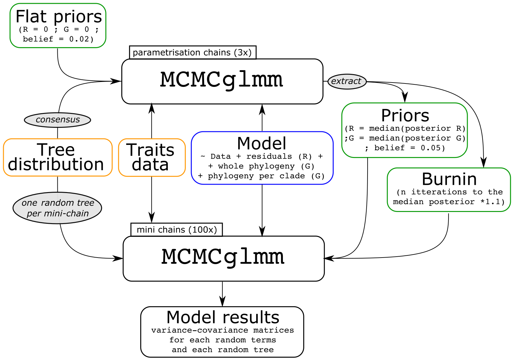

```{r, echo = FALSE}
## For a fancy vignette
library(knitr)
```

This vignette explains the details of how the mini chains MCMCglmm method works and how to use it's implementation in the [`mcmcmcglmmm`](https://github.com/TGuillerme/mcmcmcglmmm) package.
Note that this method is entirely based on Jarrod Hadfield's [`MCMCglmm` package](https://cran.r-project.org/web/packages/MCMCglmm/index.html) which fits multivariate generalised linear mixed models using markov chain monte carlo techniques [@hadfield2010]. 
The `MCMCglmm` method **will not be explained in details here**.
If you need to know more about this method, please refer to the excellent vignettes provided by the `MCMCglmm` package (a brief [overview](https://cran.r-project.org/web/packages/MCMCglmm/vignettes/Overview.pdf) and a more advanced set of [course notes](https://cran.r-project.org/web/packages/MCMCglmm/vignettes/CourseNotes.pdf)).

<!-- > If you use this vignette in published work, please cite @PAPER and @mcmcmcglmmmDOI. -->

#### Important note on the structure of this vignette

This vignette is intended to provide general details on the `mcmcmcglmmm` that will be written in plain text (like this sentence).

```{r}
## This vignette also contains reproducible examples written in R snippets
this_is_a_reproducible_R_snippet <- TRUE
```

> And finally, details about specific parameters used in the paper for repeatability will be displayed in notes like this one.


## Installation and requirements

To install the `mcmcmcglmmm` package, you can do it by directly downloading the latest version on GitHub using `devtools`:

```{r header, echo = TRUE, results = 'hide', message = FALSE, warning = FALSE, eval = FALSE}
## Installing the dispRity package from the CRAN
install.packages("dispRity")
## Installing the mcmcmcglmmm package from github
if(!require(devtools)) install.packages("devtools")
devtools::install_github("TGuillerme/mcmcmcglmmm")
```

```{r, echo = TRUE, results = 'hide', message = FALSE, warning = FALSE, eval = TRUE}
## Loading the packages
library(mcmcmcglmmm)
``` 

It also relies on the latest version of the [`dispRity`](https://github.com/TGuillerme/dispRity)) package (>=1.6.8) for some specific background functions.
The package will automatically install the latest version of `MCMCglmm` and `dispRity`.

# Mini chains MCMCglmm method: an efficient way to calculate variance-covariance matrices on big data with phylogenetic uncertainty

One commonly used method to estimate variance-covariance matrices from phylogenetic datasets is to use multivariate generalised linear mixed models.
This is often done in a Bayesian way using the `MCMCglmm` package (@hadfield2010; cited nearly 4000 times in the last decade).
The MCMCglmm method allows to run a generalised linear mixed model on a multidimensional dataset with an underlying phylogenetic structure.
<!-- TG:TODO: Expand that from the longevity paper -->.

Using this method we can run a nested phylogenetic model on a multidimensional dataset (here the Charadriiformes PCA shapespace).
This model will have a the multidimensional trait values as a response and the classic residual terms as an error term.
Additionally though, we can add a random error term as the phylogenetic signal.
This random error term can be expanded into four independent nested terms: one for the entire phylogenetic structure and three for each individual clade's phylogenetic structure.

$$\text{data} = \text{traits} + \text{residuals} + (\text{phylogenetic term} + \text{clade term})$$

Or in `MCMCglmm` pseudo code:

```
formula   = PC1:8 ~ trait:clade-1
random    = ~ us(at.level(clade):trait):animal + us(trait):animal
residuals = ~ us(trait):units
```
<!-- TG:TODO: explain that much better) -->

> In THE_PAPER we used a dataset of 8748 species and 8 dimensions and a model with 36 nested random terms: one for the whole phylogeny, 8 for each super-order containing at least 15 species and and 27 for each order containing at least 15 species and one residual term.

Although this method is perfectly efficiently implemented on small to relatively big datasets, the major hurdle is the calculation of the variance-covariance matrix that increases following a power law with both the number of species and the number of dimensions.
Therefore, such method becomes easily untractable on large datasets (>8k species and >3 dimensions).
Furthermore, this method's phylogenetic correction is based on a single input tree (usually the consensus tree).
This can also be problematic on big trees (i.e. > 5k species) where the notion of a consensus tree being a good representation of phylogenetic is at best misleading and at worth incorrect.
In fact, the bigger the tree, the more there is variance in topological relation between species (especially in terms of branch length towards deep branches).
Therefore, there has been a push to use tree distributions rather than consensus tree (i.e. point estimates) in using the MCMCglmm method (@healy2014; @mulTree).
This however, leads to yet another untractable computer problem: it requires running the large dataset much more than once on multiple trees (e.g. if using @mulTree) thus linearly increasing computational time.

Thus, to increase the speed of these analyses, while taking phylogenetic uncertainty into account, we used a highly parallelisable "mini chains" approach.
In brief, it runs multiple short `MCMCglmm` analyses on multiple trees and pulls the results together into one larger `MCMCglmm` that contains more variation due to phylogenetic uncertainty (where the size of the chains are optimised for speed and low RAM usage).

## Mini chains

The mini chains `MCMCglmm` method (`mcmcmcglmmm`) effectively works by running many very short parallel `MCMCglmm` on as many different tree topologies.
Effectively each mini chain generates a very small number of samples post-burnin (e.g. 10) and combine them across many replicates (e.g. 1000) into a chain containing effectively many samples (e.g. 10000), each ran independently on a different tree toplogy.



##### Figure 2: {#fig2}
Mini chains diagram: the numerical values displayed here (number of chains, priors, etc...) are used as examples and can be tuned to fit specific questions and datasets.

In more details, the method works as follows:

 1. Running a small number of "parametrisation chains": these chains are run with the traits data and the model of interest on a consensus tree from the tree distribution, along with flat priors with a low belief parameter (effectively not putting any important weight on the priors). 
 2. Extracting parameters from the "parametrisation chains": this step allows to extract the parameters of interest from the posteriors of the "parametrisation chains". The parameters of interest are the conservative burnin average time (here defined as highest number of iterations required to reach the median posterior likelihood across the parametrisation chains with an additional 10% extra generations) and the mini chains priors (the median posterior model results - ignoring the previously estimated burnin - with a slightly higher belief parameter than for the previous chains).
 3. Running the mini chains: these chains use the same data and model as for the "parametrisation chains" but use a random tree from the tree distribution rather than the consensus one. Furthermore, they use the parameters previously estimated (i.e. the priors and the burnin phase). These chains are run just for a small number of itterations past the burnin phase to extract a fixed number of samples (e.g. if the sampling rate is every 100 generations and the requested number of samples, the chain runs for $\text{burnin iterations} + \text{requested_samples} \times \text{sampling rate}$).
 4. Combining the mini chains: finally we can combine the post-burnin samples from all the mini chains back into a single classical `MCMCglmm` chain (with no burnin).

Each step are described and demonstrated in more details below.

### Effectiveness

In a practical implication of the mini-chains, we ran for another project a similar model on 8748 species with 8 dimensions and 31 nested levels.
Using this method, it took effectively 20 parallel cores with 8GB of RAM 2 months to complete the model with each individual mini-chain running for around 40 hours (using the SHARC cluster from Sheffield: CITE).
We estimated that the same model using the normal `MCMCglmm` implementation would have required 2.1 years and 4TB of RAM. 

This method thus allows to run multivariate generalised linear mixed effects models on large datasets and across a tree distribution.
The posteriors of this analyses contain a number of variance-covariance matrices (`model$VCV` in a `MCMCglmm` output) and their location in the trait space (`model$Sol` in a `MCMCglmm` output).
We can then use these distributions of variance-covariance matrices as major axes in the multidimensional space on which to run the elaboration and exploration analyses.

# Detailed example

Here we illustrate the `mcmcmcglmmm` pipeline by applying it to a data set from @cooney2017 focused on the birds charadriiformes order.

## Data

This order contains 359 species divided into three clades: gulls, sandpipers and plovers and sandpipers that have respectively 159, 102 and 98 species each.
For each of these species, we used the 3D beak dataset from @cooney2017 that is an ordination of the shapes of the beaks of 8748 birds (the resulting shape space used here does not contain any information about the beak size - i.e. centroid size).
We extracted the 359 charadriiformes species from this space where the first three dimensions account for more than 99% of the variance in the dataset.
For the rest of the example analysis here, we used as a traitspace of these 359 species with 3 dimensions (hereafter the shapespace).

```{r, echo = FALSE, eval = TRUE}
## Loading the charadriiformes data
data(charadriiformes)
## Extracting the tree
tree <- charadriiformes$tree
## Extracting the data column that contains the clade assignments
data <- charadriiformes$data[, "clade"]
## Changing the levels names (the clade names) to colours
levels(data) <- c("orange", "blue", "darkgreen")
data <- as.character(data)
## Matching the data rownames to the tip order in the tree
data <- data[match(ladderize(tree)$tip.label, rownames(charadriiformes$data))]

## Matching the tip colours (labels) to their descending edges in the tree
## (and making the non-match edges grey)
clade_edges <- match.tip.edge(data, tree, replace.na = "grey")

## Plotting the results
plot(ladderize(tree), show.tip.label = FALSE, edge.color = clade_edges, main = "Charadriiformes")
legend("bottomleft", lty = c(1,1,1), col = c("blue", "darkgreen", "orange"), legend = c("plovers", "sandpipers", "gulls"))
axisPhylo()
```

##### Figure 5: {#fig5}
The Charadriiformes data used in this pipeline illustration. The axis units are millions of years ago.


## Mini-chains MCMCglmm method

To illustrate the `mcmcmcglmmm` pipeline, we analysed the variance-covariance of the shapespace using a generalised linear mixed model with two different levels of random terms: one for the whole charadriiformes phylogeny and one different one for each different clade (gulls, plovers and sandpipers).
We first run three parametrisation chains for 50000 generations with no burnin and a sampling every 500 generations.
From this chain we extracted: 1) the maximum burnin time as 1.1 times the number of generations required to reach the median likelihood value and 2) the median posteriors of the model (discarding the burnin) as priors for our mini chains models with a believe parameter value of 5%.
We then ran 50 minichains for 10 samples each using the previous sampling rate (500 generations) and the extracted parameters form the parametrisation chain (the burnin and priors described above).

```{r, echo = FALSE, eval = FALSE}
## Making the parametrisation chains
parametrisation_chains <- make.mini.chains(data = charadriiformes$data,
                                           dimensions = c("PC1", "PC2", "PC3"),
                                           randoms = c("global", "clade"),
                                           residuals = "global",
                                           tree = charadriiformes$tree,
                                           parameters = list(nitt = 50000, burnin = 0, thin = 500))
```

The main arguments here are:

 * `data`: the dataset as described above. If you use the phylogeny or clades as a random term, it needs to have one column called `"animal"` and another one named by the grouping factor (here `"clade"`).
 * `dimensions`: which dimensions from `data` to include. If the argument is a numeric value (like `1:3`) it automatically picks the corresponding columns that have numeric values (here `"PC1"`, `"PC2"` and `"PC3"`). However, you can also directly specify the name of the column (e.g. `c("PC1", "PC2", "PC3")` would five the same results).
 * `tree`: the tree to use. Here we use only one tree (the consensus one) but later we are going to use a tree distribution.
 * `trait.family`: which corresponds to the `family` argument in `MCMCglmm`. Note that if you specify only one family (here `"gaussian"`) it is applied to all the traits (here `"PC1"`, `"PC2"` and `"PC3"`). But you can also specify a vector of families (e.g. `c("gaussian", "poisson", "gaussian")`).
 * `randoms`: which random terms to use. Here `"global"` is the generic term for applying a random term to the whole dataset (the phylogeny) and `"clade` allows to apply another nested random terms to the elements described in the column `"clade"` in the dataset. Note that you can play around with many more options for the random terms by looking at the function manual (`?make.mini.chains`).
 * `residuals`: which residual terms to use. This is the same as the `randoms` argument. The `"global"` term is the generic term for applying the residuals to the whole dataset (traits) and no other nested term has been provided.
 * `priors`: setting up the prior. Here you can provide a list of priors in the proper `MCMCglmm` format (see below) or, as we are doing here, simply a flat prior for each term. To provide a flat prior, you just need to give the belief parameter value (here 2%) and the function will generate the correct flat priors attached to this belief.

The other arguments here are either self evident (e.g `verbose`) or the same as for `MCMCglmm` (here `parameters` is just a list of arguments with the correct names to be passed to `MCMCglmm`).
Once the mini chain is ready, you can run it using the `run.mini.chains` function given the mini chain (`param_MCMCglmm`) and a number of replicates (here 3).

```{r, echo = FALSE, eval = FALSE}
## Running the parametrisation chains
param_results <- run.mini.chains(parametrisation_chains, replicates = 3)
## Saving the parameter model results
save(param_results, file = "param_results.rda")
```

> For THE_PAPER we ran three independent parametrisation chains for a 100k iterations (`nitt`) with a sampling (`thin`) every 500 iterations.

Once the three chains are computed as a list of parametrisation models, we can visualise the diagnosis status of it.
Note that ideally the parametrisation chains converge, however, there can be a time trade-off between running the model on the consensus tree until it converges and then running the mini-chains: the longer the parametrisation chains the longer the resulting mini-chains will take.
Ultimately the focus on the convergence of the mini-chains is what is more important and what can be used for further analysis.

```{r, echo = FALSE, eval = TRUE}
## Loading the parameter results
load("param_results.rda")
## Diagnosing the results
diagnose.mini.chains(param_results)
```

Once relatively happy with the diagnosed chains (in this case a potential scale reduction factor higher than 1), we can automatically extract the parameters from the three chains to be used as the parameters for the mini-chains:

```{r, echo = FALSE, eval = TRUE}
## Extracting the parameters
params <- extract.parameters(param_results)

## The sampling rate:
sampling <- 500
## The required number of samples per tree
samples <- 10
```

We can then build a mini chain with the same model as previously but using the newly calculated parameters.
In this example, we replicated the chains 100 times across 10 random trees.
We then can use the `combine.mini.chains` function to combine these 100 mini-chains into a single `MCMCglmm` posterior chain. 

> For THE_PAPER we ran the analysis 400 times across 1000 random trees.

```{r, echo = FALSE, eval = FALSE}
## Making the mini chains
parametrisation_chains <- make.mini.chains(data = charadriiformes$data,
                                           dimensions = c("PC1", "PC2", "PC3"),
                                           randoms = c("global", "clade"),
                                           residuals = "global",
                                           priors = params$priors,
                                           tree = charadriiformes$tree_distribution,
                                           parameters = list(
                                            nitt = params$burnin + samples*sampling,
                                            burning = params$burnin,
                                            thin = sampling))
## Running the mini chains
results <- run.mini.chains(parametrisation_chains, replicates = 100)
## Combining all the mini chains into a single posterior chains
posteriors <- combine.mini.chains(results)
## Saving the results
save(posteriors, file = "posteriors.rda")
```

This resulted in obtaining 1000 exploitable posterior variance-covariance matrices for each residual terms of our model: the overall phylogenetic effect and the three specific phylogenetic effects for each of the three clades.
These results can then be diagnosed as previously.
However since the chains were combined, the `diagnose.mini.chains` function doesn't check for a potential scale reduction factor (i.e. a diagnosis of convergence) but rather for the resulting effective sample size in the posteriors.
It is good practice to reach an effective sample size of at least 200 but for the brevity of this example, you can notice that some parameters don't reach that values.

```{r, echo = FALSE, eval = TRUE}
## Loading the combined mini chains
load("posteriors.rda")
## Plotting the posteriors' effective sample sizes
silent <- diagnose.mini.chains(posteriors, plot = TRUE)
```

## Elaboration and innovation analysis

To then analyse these results in the same way we did for THE_PAPER, please refer to [the projections analyse vignette](link) from the `dispRity` package.

## References
